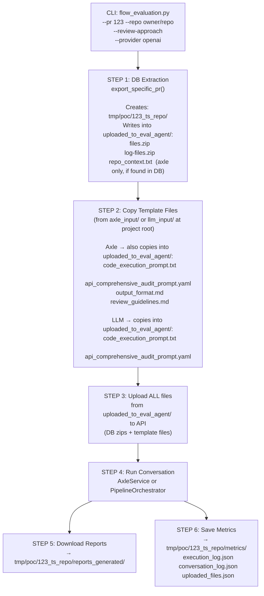

# Technical Implementation Plan — Unified PR Evaluation Flow

## Goal
Create `flow_evaluation.py` in `db-files-upload-poc/`. It extracts PR data from DB, copies the appropriate template/prompt files into the PR folder, then routes to LLM or Axle review. Each PR evaluation run is **self-contained**—all files needed are inside the PR's own folder.

---

## Architecture



---

## Folder Structure

```
db-files-upload-poc/                         ← project root
├── axle_input/                              ← source templates (currently manual, future: DB)
│   ├── code_execution_prompt.txt
│   ├── api_comprehensive_audit_prompt.yaml
│   ├── output_format.md
│   └── review_guidelines.md
│
├── llm_input/                               ← source templates (currently manual, future: DB)
│   ├── code_execution_prompt.txt
│   └── api_comprehensive_audit_prompt.yaml
│
├── flow_evaluation.py                       ← [NEW] unified orchestration script
├── main.py                                  ← unchanged
│
└── tmp/poc/                                 ← accumulates one folder per evaluation run
    ├── 123_1738000000_repo-name/            ← PR 123, run 1
    │   ├── code_execution_prompt.txt        ← copied from axle_input/ or llm_input/
    │   ├── api_comprehensive_audit_prompt.yaml  ← copied
    │   ├── output_format.md                 ← copied (axle only)
    │   ├── review_guidelines.md             ← copied (axle only)
    │   ├── uploaded_to_eval_agent/
    │   │   ├── files.zip                    ← from DB (changed file content)
    │   │   ├── log-files.zip                ← from DB (prompts, metrics, responses)
    │   │   └── repo_context.txt             ← from DB (axle only, if available)
    │   ├── reports_generated/               ← downloaded audit reports
    │   └── metrics/
    │       ├── execution_log.json
    │       ├── conversation_log.json
    │       └── uploaded_files.json
    │
    ├── 123_1738010000_repo-name/            ← PR 123, run 2 (same PR, re-run)
    └── 456_1738000000_other-repo/           ← different PR
```

> [!NOTE]
> `axle_input/` and `llm_input/` are read-only source folders at the project root. The script **copies** from them into each PR's `uploaded_to_eval_agent/` — so every run is self-contained and reproducible.

> [!NOTE]
> `tmp/poc/` naturally accumulates multiple folders. Each run always creates a new `<PR>_<timestamp>_<repo>/` folder, so no run ever overwrites another.

---

## Files to Create / Modify

### [NEW] `db-files-upload-poc/flow_evaluation.py`
### [MODIFY] `db-files-upload-poc/db/review_data_extractor.py`
Rename folder name strings in `_create_pr_directories()`:
- `"uploads"` → `"uploaded_to_eval_agent"`
- `"artifacts"` → `"reports_generated"`

### [MODIFY] `db-files-upload-poc/services/axle/axle_service.py`
Same folder name updates in `__init__`:
- `"artifacts"` → `"reports_generated"`
- `"uploads"` → `"uploaded_to_eval_agent"`

---

## `flow_evaluation.py` — Function Breakdown

### Constants
```python
PROJECT_ROOT       = Path(__file__).parent
TMP_POC_DIR        = PROJECT_ROOT / "tmp" / "poc"
DEFAULT_AXLE_INPUT = PROJECT_ROOT / "axle_input"   # source templates for axle
DEFAULT_LLM_INPUT  = PROJECT_ROOT / "llm_input"    # source templates for llm
```

---

### `class PipelineOrchestrator`
Ported from the commented-out code in `db-files-upload-poc/main.py` (lines 21–290).

| Method | Purpose | Output |
| --- | --- | --- |
| `__init__(provider_id, output_dir)` | Create provider; `output_dir` = PR's `metrics/` folder | — |
| `upload_files(file_paths) -> bool` | Upload files; save IDs to `metrics/uploaded_files.json` | `uploaded_files.json` |
| `execute_task(prompt_path, reports_dir) -> bool` | Run conversation; save raw result; download artifacts | `execution_log.json`, `conversation_log.json`, reports |
| `_extract_and_download_artifacts(result, reports_dir)` | Download from claude/openai into `reports_generated/` | audit report files |
| `run(file_paths, prompt_path, reports_dir) -> int` | Full pipeline: upload → run → download → return exit code | all outputs |

---

### `def extract_pr_data(args) -> dict`
Calls `ReviewDataExtractor.export_specific_pr()`. Returns the PR result dict containing:
- `pr_dir` → `tmp/poc/<PR_DIR>/`
- `zip_paths` → `{'files_zip': '...', 'logs_zip': '...'}`
- `repo_context_file` → path inside `uploaded_to_eval_agent/` or `None`

---

### `def copy_templates(pr_dir: Path, review_approach: str, input_dir: Path) -> None`
Copies template files from `input_dir` into the **PR folder root** (`tmp/poc/<PR_DIR>/`), not inside `uploaded_to_eval_agent/`.

```
Axle: copies all 4 files (prompt, yaml, output_format, review_guidelines)
LLM:  copies 2 files    (prompt, yaml)
```

---

### `def build_file_paths(pr_dir: Path, uploaded_dir: Path, review_approach: str) -> list[str]`
Returns files from two locations:
- Templates copied to `pr_dir/` (prompt, yaml, etc.)
- DB exports from `pr_dir/uploaded_to_eval_agent/` (zips, repo_context.txt)

---

### `async def run_llm_mode(args, pr_result, input_dir) -> int`
1. `copy_templates(uploaded_dir, 'llm', input_dir)`
2. `file_paths = build_file_paths(uploaded_dir)` 
3. `prompt_path = uploaded_dir / 'code_execution_prompt.txt'`
4. `PipelineOrchestrator(args.provider, metrics_dir).run(file_paths, prompt_path, reports_dir)`

---

### `async def run_axle_mode(args, pr_result, input_dir) -> int`
1. `copy_templates(uploaded_dir, 'axle', input_dir)`
2. `file_paths = build_file_paths(uploaded_dir)`
3. `prompt_path = uploaded_dir / 'code_execution_prompt.txt'`
4. `AxleService(project_root, pr_dir).execute_task(args.provider, file_paths, prompt_path)`

---

### `async def main()` — CLI Arguments
| Argument | Values | Default | Notes |
| --- | --- | --- | --- |
| `--pr` | any string | required | PR number |
| `--repo` | `owner/repo` | required | Repository |
| `--mode` | `extract_only` | `None` | Skip review step |
| `--review-approach` | `axle`, `llm` | **required** | Review engine — must be explicitly provided |
| `--provider` | `claude`, `openai` | `openai` | LLM provider |
| `--input-dir` | any path | auto | Override default `axle_input/` or `llm_input/` |

---

## CLI Commands

```bash
# Extract DB data only — no review (review-approach not needed)
python flow_evaluation.py --pr 123 --repo owner/repo --mode extract_only

# Axle review (provider defaults to openai)
python flow_evaluation.py --pr 123 --repo owner/repo --review-approach axle

# LLM review with claude
python flow_evaluation.py --pr 123 --repo owner/repo --review-approach llm --provider claude

# Custom input folder (future: DB-sourced)
python flow_evaluation.py --pr 123 --repo owner/repo --review-approach axle --input-dir /path/to/inputs/
```
