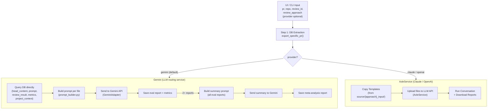

# Technical Implementation Plan — Unified PR Evaluation Flow

## Goal

`flow_evaluation.py` is the single entry point for all PR code review evaluation.
A future UI will collect the required inputs (PR number, repo, review ID, review approach, provider)
and trigger the same evaluation pipeline.

**Required inputs:**
- **PR number** — which pull request to evaluate
- **Repository** — `owner/repo` format
- **Review ID** — identifies the specific review run in the DB
- **Review approach** — `axle` or `llm` (controls which prompt templates are used)

**Optional inputs:**
- **Provider** — `gemini` (default), `claude`, or `openai`
- **Model** — override the default model for the selected provider
- **File filter** — evaluate a single file instead of all files

---

## Architecture


```mermaid
flowchart TD
    INPUT["UI / CLI Input\npr, repo, review_id,\nreview_approach\n(provider optional)"]

    INPUT --> EXTRACT["Step 1: DB Extraction\nexport_specific_pr()"]

    EXTRACT --> ROUTE{provider?}

    ROUTE -->|"gemini (default)"| GEMINI_FLOW
    ROUTE -->|"claude / openai"| AXLE_FLOW

    subgraph GEMINI_FLOW["Gemini (LLM routing service)"]
        G1["Query DB directly\n(head_content, prompt,\nreview_result, metrics,\nproject_context)"]
        G2["Build prompt per file\n(prompt_builder.py)"]
        G3["Send to Gemini API\n(GeminiAdapter)"]
        G4["Save eval report + metrics"]
        G5["Build summary prompt\n(all eval reports)"]
        G6["Send summary to Gemini"]
        G7["Save meta-analysis report"]
        G1 --> G2 --> G3 --> G4
        G4 -->|"2+ reports"| G5 --> G6 --> G7
    end

    subgraph AXLE_FLOW["AxleService (Claude / OpenAI)"]
        A1["Copy Templates\n(from source/{approach}_input/)"]
        A2["Upload files to LLM API\n(AxleService)"]
        A3["Run Conversation\n+ Download Reports"]
        A1 --> A2 --> A3
    end
```

---

## Folder Structure

```
pr-eval-agent/                                <- project root
├── source/
│   ├── axle_approach_input/                  <- axle templates
│   │   ├── code_execution_prompt.txt         <- single-file evaluation prompt
│   │   ├── summary_report_prompt.txt         <- summary/meta-analysis prompt
│   │   ├── api_comprehensive_audit_prompt.yaml
│   │   ├── output_format.md
│   │   └── review_guidelines.md
│   └── llm_approach_input/                   <- llm templates (guidelines embedded)
│       ├── code_execution_prompt.txt         <- single-file evaluation prompt
│       ├── summary_report_prompt.txt         <- summary/meta-analysis prompt
│       └── api_comprehensive_audit_prompt.yaml
│
├── flow_evaluation.py                        <- unified entry point (CLI + future UI)
│
├── utils/
│   └── prompt_builder.py                     <- builds prompts from DB records + templates
│       build_prompt()                           per-file evaluation prompt
│       build_summary_prompt()                   summary report prompt (all eval reports)
│
├── services/
│   ├── axle/                                 <- AxleService + adapters (Anthropic, OpenAI)
│   └── gemini/                               <- GeminiAdapter (Gemini LLM routing service)
│
├── db/
│   └── review_data_extractor.py              <- DB queries + export
│
└── tmp/poc/                                  <- one folder per evaluation run
    └── 18_1774355801869_repo-name/
        ├── uploaded_to_eval_agent/
        │   ├── files.zip                     <- from DB (claude/openai providers)
        │   ├── log-files.zip                 <- from DB (claude/openai providers)
        │   ├── project_context.txt           <- from DB
        │   └── file_prompt/                  <- generated prompts
        │       ├── App.js.txt                <- per-file prompt
        │       ├── Tasks.js.txt
        │       └── summary_report_prompt.txt <- summary prompt
        ├── reports_generated/                <- eval reports
        │   ├── App_eval_report.md
        │   ├── Tasks_eval_report.md
        │   └── AXLE_EVAL_META_ANALYSIS.md    <- or LLM_EVAL_META_ANALYSIS.md
        └── metrics/
            ├── App_gemini_metrics.json
            ├── Tasks_gemini_metrics.json
            └── summary_gemini_metrics.json
```

> [!NOTE]
> `source/axle_approach_input/` and `source/llm_approach_input/` are read-only template folders.
> - `code_execution_prompt.txt` — single-file evaluation (no summary/meta-analysis content)
> - `summary_report_prompt.txt` — summary/meta-analysis (reads all eval reports)
> - Templates are read directly by `prompt_builder.py` for all providers.

---

## Key Files

| File | Purpose |
|------|---------|
| `flow_evaluation.py` | Unified entry point — CLI today, UI integration point in future |
| `utils/prompt_builder.py` | `build_prompt()` — per-file eval prompt from DB record. `build_summary_prompt()` — summary prompt from all eval reports |
| `services/gemini/gemini_adapter.py` | Sends text prompt to Gemini API, returns response + metrics |
| `services/axle/axle_service.py` | Multi-file review via file upload + conversation (Anthropic/OpenAI) |
| `db/review_data_extractor.py` | DB queries: file content, prompts, responses, metrics, project context |

---

## Prompt Architecture

Each prompt type is a standalone file in `source/{approach}_input/`:

| File | Purpose | Used by |
|------|---------|---------|
| `code_execution_prompt.txt` | Single-file evaluation instructions + report template (Sections 1-7) | `build_prompt()` |
| `summary_report_prompt.txt` | Summary/meta-analysis instructions + report template (Dashboard, Sections 1-10, Final Verdict) | `build_summary_prompt()` |
| `api_comprehensive_audit_prompt.yaml` | Audit guidelines and format schema | Both |
| `review_guidelines.md` | Permitted categories, severity levels, decision tree (axle only) | `build_prompt()` |
| `output_format.md` | JSON schema specification (axle only) | `build_prompt()` |

**Axle vs LLM approach difference:**
- **axle**: `code_execution_prompt` + `audit YAML` + `review_guidelines` + `output_format`
- **llm**: `code_execution_prompt` + `audit YAML` (guidelines already embedded in prompt log)

---

## Evaluation Inputs

### Required

| Input | Description | CLI flag |
|-------|-------------|----------|
| PR number | Which pull request to evaluate | `--pr` |
| Repository | `owner/repo` format | `--repo` |
| Review ID | Identifies the review run in DB | `--review-id` |
| Review approach | `axle` or `llm` — controls prompt templates | `--review-approach` |

### Optional

| Input | Description | CLI flag | Default |
|-------|-------------|----------|---------|
| Provider | Where to send the evaluation | `--provider` | `gemini` |
| Model | Override default model for provider | `--model` | provider default |
| File filter | Evaluate only this file (partial match) | `--file` | all files |
| Dry run | Build prompts only, skip LLM calls | `--dry-run` | `false` |
| Input dir | Override template directory | `--input-dir` | auto from approach |
| Mode | `extract_only` — DB extraction, no eval | `--mode` | full evaluation |

---

## Evaluation Flow

### Step 1: DB Extraction

```
export_specific_pr(repository, pr_number, review_id)
  -> Creates PR folder: tmp/poc/<PR>_<timestamp>_<repo>/
  -> Exports: files.zip, log-files.zip, project_context.txt
```

### Step 2: Per-File Evaluation

For each file in the PR:

```
a. Build Prompt -> prompt_builder.build_prompt(record, review_approach)
   Reads templates from source/{approach}_input/
   Merges with DB data: head_content, prompt, review_result, metrics, project_context

b. Send to Provider -> GeminiAdapter.evaluate() or AxleService.execute_task()

c. Save Outputs:
   reports_generated/{filename}_eval_report.md
   metrics/{filename}_{provider}_metrics.json
   uploaded_to_eval_agent/file_prompt/{filename}.txt
```

### Step 3: Summary Report

After all file evaluations complete (requires 2+ eval reports):

```
a. Build Summary Prompt -> prompt_builder.build_summary_prompt(reports_dir, review_approach)
   Reads summary_report_prompt.txt template
   Appends all *_eval_report.md files in full

b. Send to Provider

c. Save Outputs:
   reports_generated/AXLE_EVAL_META_ANALYSIS.md  (or LLM_EVAL_META_ANALYSIS.md)
   metrics/summary_{provider}_metrics.json
```

---

## CLI Commands

### Full Evaluation (all files + summary report)

```bash
python flow_evaluation.py --pr 18 --repo owner/repo --review-id 123456 --review-approach axle

python flow_evaluation.py --pr 18 --repo owner/repo --review-id 123456 --review-approach llm
```

### With Specific Provider

```bash
python flow_evaluation.py --pr 18 --repo owner/repo --review-id 123456 --review-approach axle --provider claude

python flow_evaluation.py --pr 18 --repo owner/repo --review-id 123456 --review-approach llm --provider openai
```

### Single File Evaluation

```bash
python flow_evaluation.py --pr 18 --repo owner/repo --review-id 123456 --review-approach axle --file schema.py
```

### Dry Run (build prompts only, no LLM calls)

```bash
python flow_evaluation.py --pr 18 --repo owner/repo --review-id 123456 --review-approach axle --dry-run
```

### DB Extraction Only

```bash
python flow_evaluation.py --pr 123 --repo owner/repo --mode extract_only
```

---

## Future UI Integration

The UI will collect the same required inputs and call the evaluation pipeline:

```
┌─────────────────────────────────────────┐
│  PR Evaluation                          │
│                                         │
│  PR Number:      [18           ]        │
│  Repository:     [owner/repo   ]        │
│  Review ID:      [123456       ]        │
│  Review Approach: (•) Axle  ( ) LLM    │
│  Provider:        Gemini  ▼  (optional) │
│                                         │
│  [ Run Evaluation ]  [ Dry Run ]        │
└─────────────────────────────────────────┘
```

The UI will invoke the same pipeline as the CLI — the core logic in
`flow_evaluation.py`, `prompt_builder.py`, and the provider adapters
remains unchanged.

---

## Environment Variables

```bash
# Required for Gemini provider (default)
GEMINI_API_KEY=AIzaSy...

# Required for AxleService providers
ANTHROPIC_API_KEY=sk-ant-...
OPENAI_API_KEY=sk-proj-...

# Database connection
DB_HOST=...
DB_PORT=...
DB_NAME=...
DB_USER=...
DB_PASSWORD=...
```
